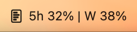
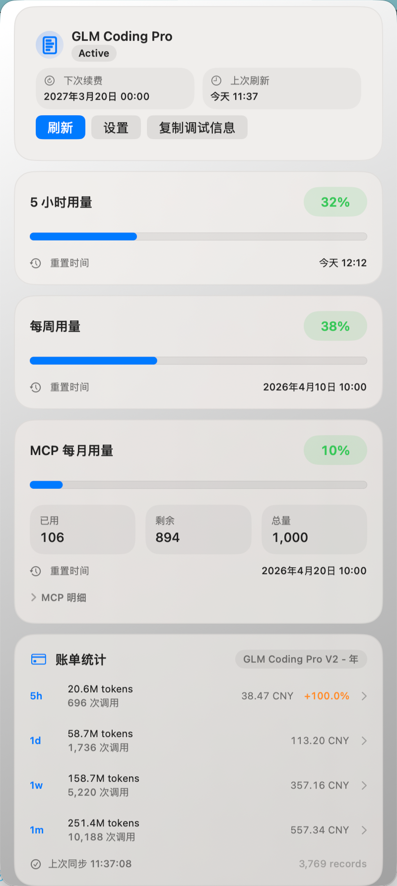
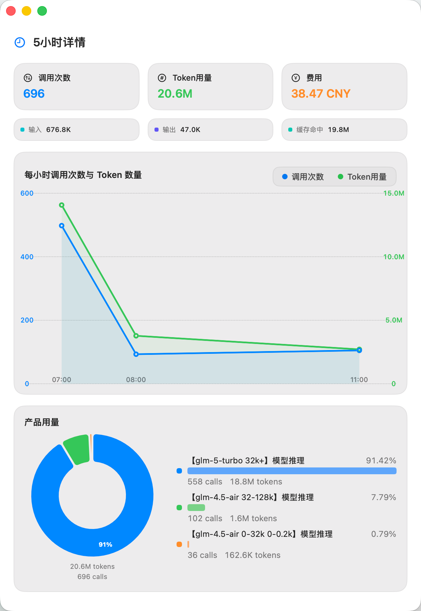
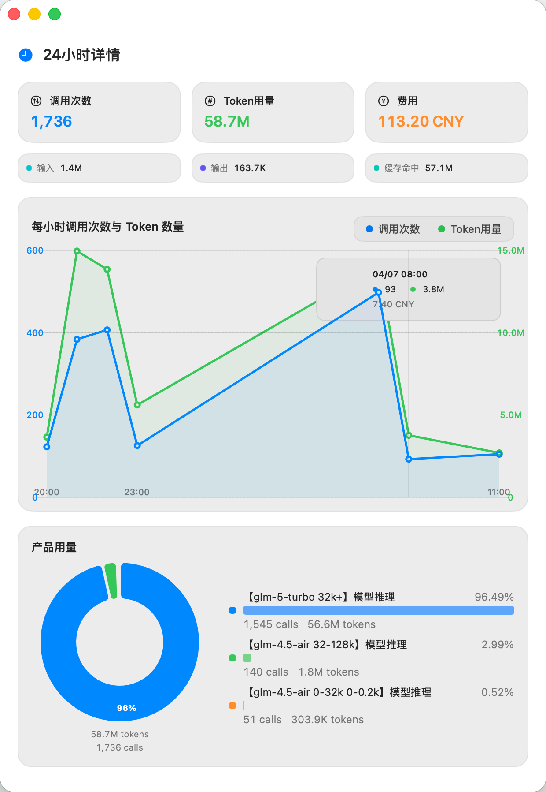
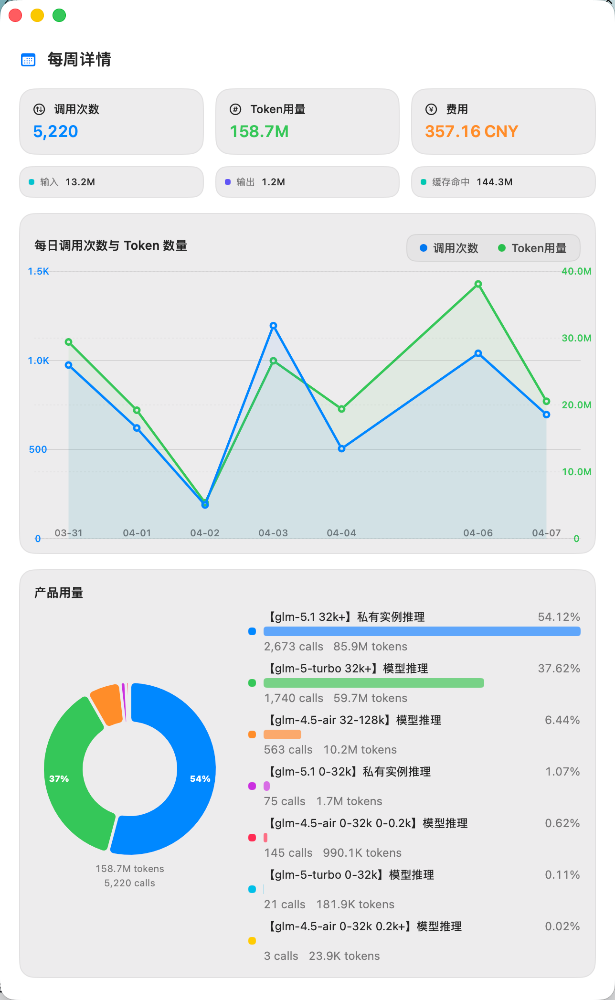
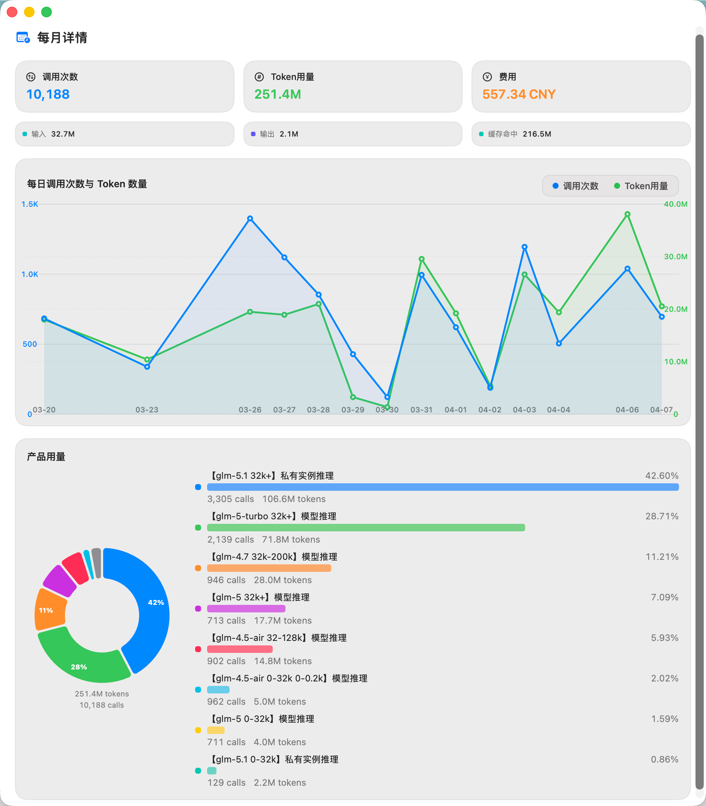
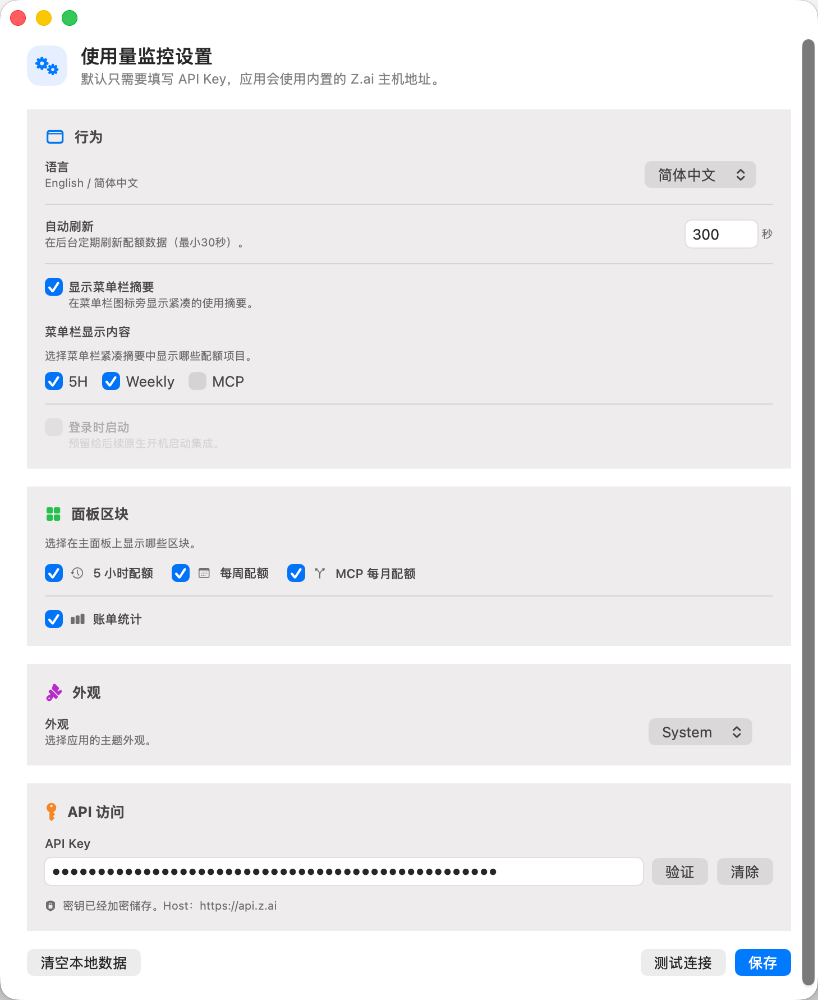

# GLM Usage Details

[中文](#中文) | [English](#english)

---

<a id="中文"></a>

## 中文

一款 macOS 菜单栏工具，用于实时监控智谱 AI（Z.ai）API 的配额使用情况与账单统计。

### 功能特性

- **菜单栏实时监控** — 在菜单栏显示当前配额使用摘要，一目了然
- **多维度配额追踪** — 同时追踪 5 小时、每周和 MCP 每月三种配额
- **账单统计** — 展示调用次数、Token 用量（输入/输出/缓存命中）、费用及增长率
- **多时段详情** — 支持查看 5 小时、24 小时、每周和每月的详细用量曲线
- **深色/浅色主题** — 支持跟随系统、浅色、深色三种外观模式
- **中英双语** — 界面支持中文和英文切换
- **自动刷新** — 可配置后台自动刷新间隔（最小 30 秒）
- **安全存储** — API Key 使用 macOS Keychain 加密存储

### 截图

启动后应用以图标形式驻留在菜单栏，点击即可展开主面板：

<div align="center">
  
</div>

主面板展示订阅信息、配额使用卡片和账单统计概览：

<div align="center">
  
</div>

点击账单统计区域的不同时段，可查看详细用量曲线：

| 5 小时详情 | 24 小时详情 |
|:---:|:---:|
|  |  |

| 每周详情 | 每月详情 |
|:---:|:---:|
|  |  |

设置面板支持配置 API Key、Host 地址、自动刷新、主题、语言等选项：

<div align="center">
  
</div>

### 系统要求

- macOS 14.0 (Sonoma) 或更高版本
- Xcode 16+（仅开发时需要）

### 安装

**方式一：下载 DMG**

从 [Releases](../../releases) 页面下载最新版本的压缩包，解压后将 `.dmg` 文件中的应用到 `Applications` 文件夹。

> **首次打开提示"已损坏，无法打开"？**
>
> 由于尚未购买 Apple 开发者证书，应用未经 Apple 公证签名，macOS Gatekeeper 会将其识别为未知来源并拦截打开。这不是应用本身存在问题。
>
> 解决方法：安装后、首次打开前，在终端执行以下命令移除隔离标记即可：
>
> ```bash
> sudo xattr -r -d com.apple.quarantine /Applications/GlmUsageDetails.app
> ```
>
> 执行后即可正常打开应用。

<details>
<summary>💬 写在后面</summary>

这是我独立开发的第一个 macOS 应用。从学习 Swift 到完成这个项目，花了不少时间和精力。如果你觉得这个工具有帮助，欢迎给一个 ⭐ Star — 你的认可是我继续开发的最好动力。也许攒够了 Star，我就有理由去买一个 Apple 开发者账号，让安装体验变得更好 😊

</details>

**方式二：从源码构建**

```bash
# 克隆仓库
git clone https://github.com/your-username/GLMUsageDetails.git
cd GLMUsageDetails

# 构建并运行
make run

# 或仅构建
make build
```

### 使用说明

1. **启动应用** — 启动后应用会出现在菜单栏中，点击图标即可打开主面板
2. **配置 API Key** — 点击面板中的「设置」按钮，在设置页面粘贴你的 Z.ai API Key
3. **查看配额** — 主面板会自动显示当前配额使用情况
4. **查看详情** — 点击账单统计区域中的不同时段（5 小时 / 24 小时 / 每周 / 每月）可弹出详细用量窗口
5. **自动刷新** — 在设置中可配置自动刷新间隔，应用会在后台定期更新数据

### 配置说明

| 设置项 | 说明 | 默认值 |
|--------|------|--------|
| API Key | Z.ai API 密钥 | 无 |
| Host 地址 | API 服务地址 | `https://api.z.ai` |
| 自动刷新 | 后台刷新间隔（秒） | 300 秒 |
| 菜单栏摘要 | 在菜单栏图标旁显示使用摘要 | 开启 |
| 外观主题 | 跟随系统 / 浅色 / 深色 | 跟随系统 |
| 语言 | 界面语言 | 简体中文 |

### 项目结构

```
GLMUsageDetails/
├── Sources/UsageMonitorCore/   # 核心业务逻辑（SPM 模块）
│   ├── Billing/                # 账单同步、聚合、本地存储
│   ├── Models/                 # 配额、订阅数据模型
│   ├── Security/               # API Key 安全存储（Keychain）
│   ├── Services/               # API 客户端、配额分类
│   ├── Utilities/              # 格式化、设置、本地化字符串
│   ├── ViewModels/             # 面板、设置视图模型
│   └── Views/                  # SwiftUI 视图
├── UsageMonitorApp/            # Xcode App 目标
│   ├── AppDelegate.swift       # 应用生命周期
│   ├── AppEnvironment.swift    # 依赖注入容器
│   └── *WindowController.swift # 窗口控制器
├── Tests/                      # 单元测试
├── Scripts/                    # 构建、打包脚本
├── Package.swift               # SPM 包定义
└── Makefile                    # 构建命令
```

### 技术栈

- **Swift 6** + 严格并发检查
- **SwiftUI** + AppKit 混合开发
- **GRDB.swift** — SQLite 本地数据库
- **macOS Keychain** — API Key 安全存储
- **Swift Package Manager** — 依赖管理

### 开发

```bash
# 运行测试
make test

# 构建发布版本
make build CONFIGURATION=Release

# 打包 DMG
make dmg

# 清理构建产物
make clean
```

### 依赖

| 依赖 | 版本 | 用途 |
|------|------|------|
| [GRDB.swift](https://github.com/groue/GRDB.swift) | 7.1.1+ | SQLite 数据库，用于本地账单数据存储 |

### 许可证

[MIT License](LICENSE)

---

<a id="english"></a>

## English

A macOS menu bar app for monitoring Z.ai (Zhipu AI) API quota usage and billing statistics in real time.

### Features

- **Real-time Menu Bar Monitoring** — View quota usage summary at a glance from the menu bar
- **Multi-dimensional Quota Tracking** — Track 5-hour, weekly, and MCP monthly quotas simultaneously
- **Billing Statistics** — Display call counts, token usage (input/output/cache hit), costs, and growth rates
- **Multi-period Details** — View detailed usage charts for 5-hour, 24-hour, weekly, and monthly periods
- **Dark/Light Theme** — Support for System, Light, and Dark appearance modes
- **Bilingual UI** — Switch between Chinese and English interface
- **Auto Refresh** — Configurable background refresh interval (minimum 30 seconds)
- **Secure Storage** — API Key stored encrypted via macOS Keychain

### Screenshots

After launch, the app resides in the menu bar. Click the icon to open the main panel:

<div align="center">
  
</div>

The main panel displays subscription info, quota usage cards, and billing statistics:

<div align="center">
  
</div>

Click on different time periods in the billing stats section to view detailed usage charts:

| 5-Hour Detail | 24-Hour Detail |
|:---:|:---:|
|  |  |

| Weekly Detail | Monthly Detail |
|:---:|:---:|
|  |  |

The settings panel allows configuring API Key, Host URL, auto refresh, theme, language, and more:

<div align="center">
  
</div>

### System Requirements

- macOS 14.0 (Sonoma) or later
- Xcode 16+ (development only)

### Installation

**Option 1: Download DMG**

Download the latest zip from the [Releases](../../releases) page, extract the `.dmg`, and drag the app to your `Applications` folder.

> **"App is damaged and can't be opened" on first launch?**
>
> Since I don't have an Apple Developer certificate yet, the app is not signed or notarized by Apple. macOS Gatekeeper will block it as an unidentified developer. This does not mean the app is harmful.
>
> **Fix:** Run the following command in Terminal before opening the app for the first time:
>
> ```bash
> sudo xattr -r -d com.apple.quarantine /Applications/GlmUsageDetails.app
> ```
>
> After that, the app will open normally.

<details>
<summary>💬 A note from the author</summary>

This is the first macOS app I've built as an independent developer. It took a lot of time and effort going from learning Swift to shipping this. If you find it useful, a ⭐ Star would mean the world to me — it's the best motivation to keep going. Who knows, maybe with enough stars I'll finally have a reason to buy an Apple Developer account and make the installation experience seamless 😊

</details>

**Option 2: Build from Source**

```bash
# Clone the repository
git clone https://github.com/your-username/GLMUsageDetails.git
cd GLMUsageDetails

# Build and run
make run

# Or build only
make build
```

### Usage

1. **Launch** — The app appears in the menu bar after launch. Click the icon to open the main panel
2. **Configure API Key** — Click the "Settings" button in the panel, then paste your Z.ai API Key in the settings page
3. **View Quotas** — The main panel automatically displays current quota usage
4. **View Details** — Click on different time periods (5h / 24h / 1w / 1m) in the billing stats section to open detailed usage windows
5. **Auto Refresh** — Configure the refresh interval in settings; the app updates data in the background periodically

### Configuration

| Setting | Description | Default |
|---------|-------------|---------|
| API Key | Z.ai API key | None |
| Host URL | API server address | `https://api.z.ai` |
| Auto Refresh | Background refresh interval (seconds) | 300 sec |
| Menu Bar Summary | Show usage summary next to menu bar icon | On |
| Appearance | System / Light / Dark | System |
| Language | Interface language | Simplified Chinese |

### Project Structure

```
GLMUsageDetails/
├── Sources/UsageMonitorCore/   # Core business logic (SPM module)
│   ├── Billing/                # Billing sync, aggregation, local storage
│   ├── Models/                 # Quota and subscription data models
│   ├── Security/               # API Key secure storage (Keychain)
│   ├── Services/               # API client, quota classification
│   ├── Utilities/              # Formatting, settings, localization strings
│   ├── ViewModels/             # Panel and settings view models
│   └── Views/                  # SwiftUI views
├── UsageMonitorApp/            # Xcode App target
│   ├── AppDelegate.swift       # App lifecycle
│   ├── AppEnvironment.swift    # Dependency injection container
│   └── *WindowController.swift # Window controllers
├── Tests/                      # Unit tests
├── Scripts/                    # Build and packaging scripts
├── Package.swift               # SPM package definition
└── Makefile                    # Build commands
```

### Tech Stack

- **Swift 6** with strict concurrency checking
- **SwiftUI** + AppKit hybrid development
- **GRDB.swift** — SQLite local database
- **macOS Keychain** — API Key secure storage
- **Swift Package Manager** — Dependency management

### Development

```bash
# Run tests
make test

# Build release version
make build CONFIGURATION=Release

# Package DMG
make dmg

# Clean build artifacts
make clean
```

### Dependencies

| Dependency | Version | Purpose |
|------------|---------|---------|
| [GRDB.swift](https://github.com/groue/GRDB.swift) | 7.1.1+ | SQLite database for local billing data storage |

### License

[MIT License](LICENSE)
